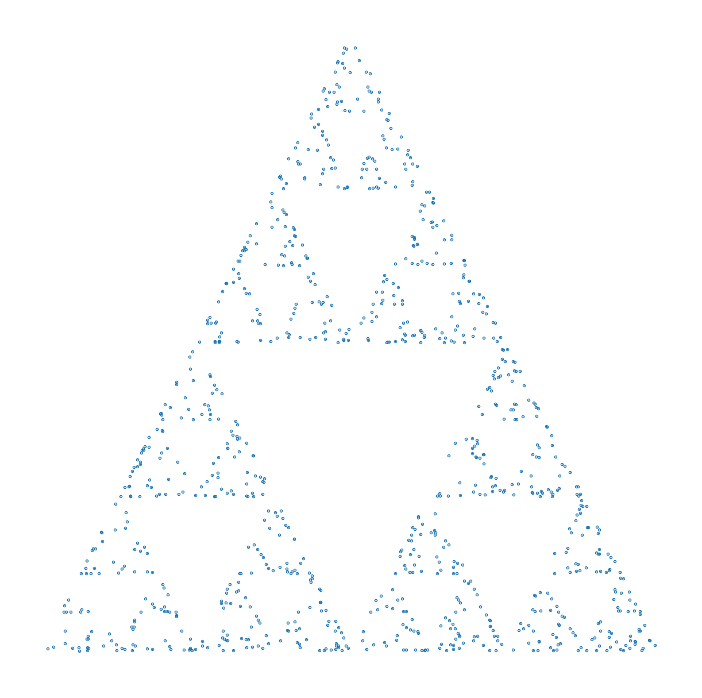
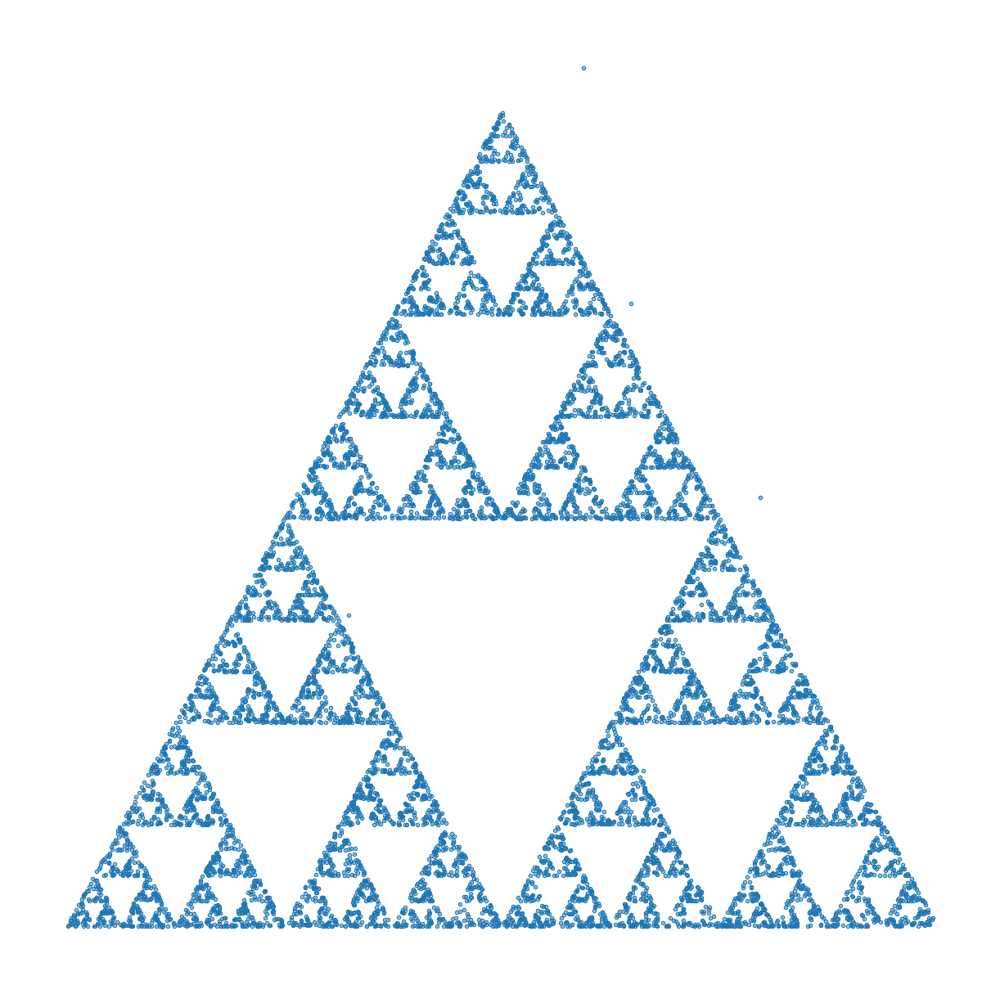
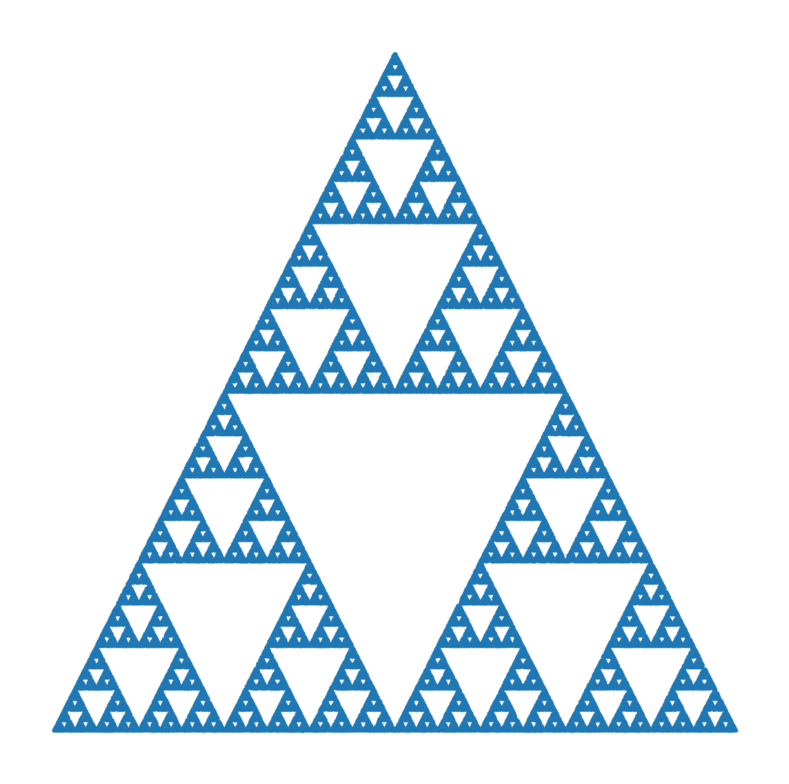
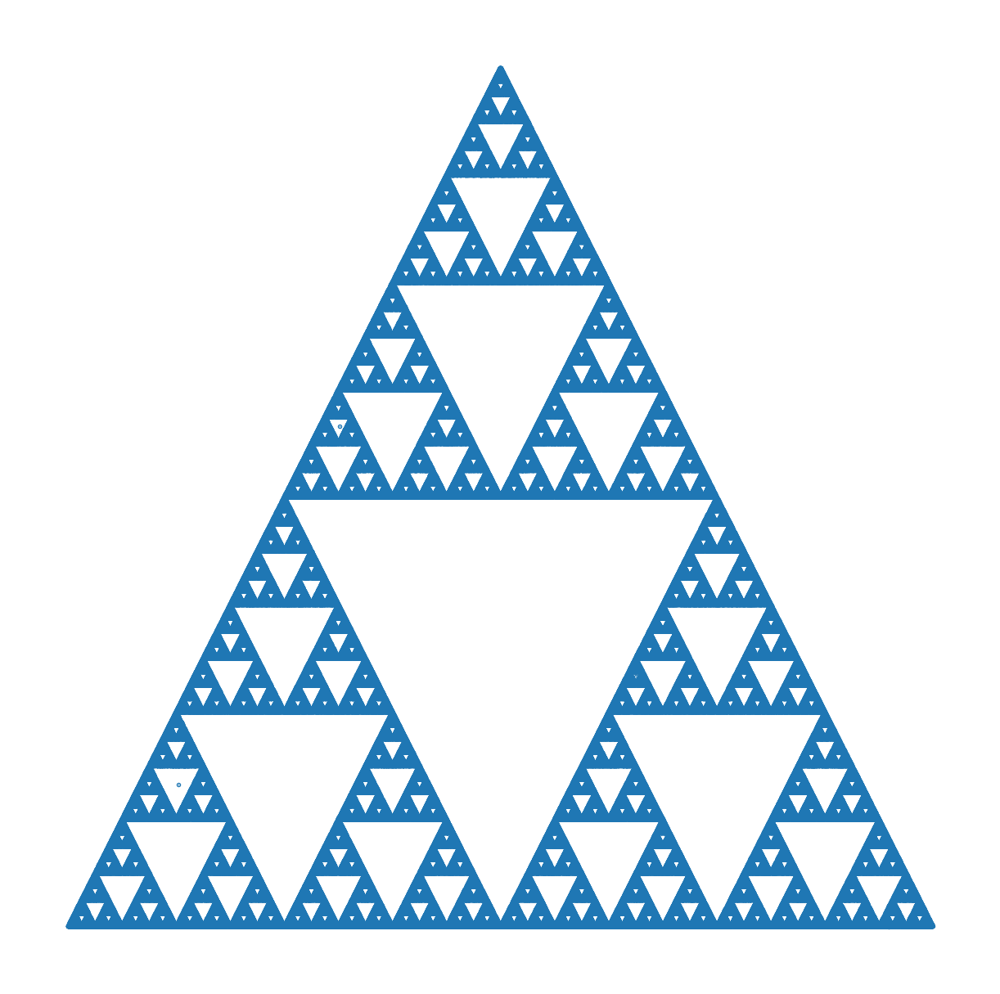

# Triângulo de Sierpinski (Chaos Game)

Este repositório demonstra o **Triângulo de Sierpinski** usando um método simples e elegante chamado **Chaos Game**.

Mesmo utilizando **escolhas aleatórias**, um padrão matemático altamente organizado surge sozinho.

---

## A ideia (explicação simples)

Imagine um jogo:

1. Desenhe um **triângulo** e marque um ponto em cada ponta (vértices)
2. Coloque **um ponto inicial aleatório** dentro do triângulo
3. Repita muitas vezes:
   - escolha **uma das três pontas do triângulo, aleatoriamente**
   - marque um novo ponto **exatamente no meio do caminho** entre o ponto atual e a ponta escolhida
   - esse novo ponto passa a ser o ponto atual

Só isso.

---

## 🎯 A regra mágica

> **Sempre ande apenas até a metade do caminho.**

Essa única regra é suficiente para criar o Triângulo de Sierpinski.

---

## 🧪 Evolução do desenho

Quanto mais pontos são desenhados, mais claro o padrão fica.

### 🔹 1.000 pontos
O padrão começa a surgir:



---

### 🔹 10.000 pontos
Os primeiros “buracos” aparecem:



---

### 🔹 100.000 pontos
O fractal já está bem definido:



---

### 🔹 1.000.000 de pontos
O Triângulo de Sierpinski aparece claramente:



---

## Por que isso é impressionante?

- As escolhas são **aleatórias**
- O resultado é **extremamente organizado**
- O mesmo padrão aparece em qualquer escala
- Nenhuma linha é desenhada, apenas pontos

Isso é um **fractal**:  
um desenho que se repete infinitamente, sempre parecido consigo mesmo.

---

## Em uma frase

> **Bagunça + regra simples = ordem perfeita**

---

## Regra matemática usada

```text
novo_ponto = (ponto_atual + vertice_escolhido) / 2
